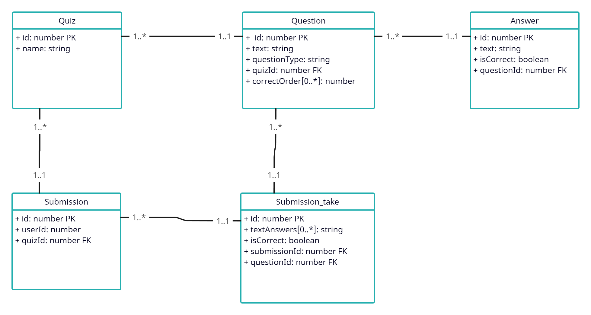

## Running the Application

1. Install the dependencies:

```bash
$ npm install
```

2. Build docker database
```bash

# Building database
docker build -t quiz-app-db .

# Running database
docker run -p 5432:5432 quiz-app-db
```

3. Start the application:
```bash
# For development
$ npm run start:dev

# For production
$ npm run start:prod
```
## Entities

The application is built around four main entities: `Quiz`, `Question`, `Answer`, and `Submission`. 

- `Quiz`: Represents a quiz. It has a one-to-many relationship with `Question` and `Submission`.
- `Question`: Represents a question in a quiz. It has a many-to-one relationship with `Quiz` and a one-to-many relationship with `Answer`.
- `Answer`: Represents an answer to a question. It has a many-to-one relationship with `Question`.
- `Submission`: Represents a submission of a quiz. It has a many-to-one relationship with `Quiz`.

Here is a visual representation of the entities and their relationships:



For more details, please refer to the entity files in the `src/modules` directory:

- [`Quiz`](src/modules/quiz/quiz.entity.ts)
- [`Question`](src/modules/question/question.entity.ts)
- [`Answer`](src/modules/answer/answer.entity.ts)
- [`Submission`](src/modules/submission/submission.entity.ts)

F0xywow: @workspace I want to dockerize my database 

GitHub Copilot: Determining workspace structure

Deciding which workspace information to collect

Gathering workspace info

To dockerize your PostgreSQL database, you can create a `Dockerfile` with the following content:

```Dockerfile
FROM postgres:latest

ENV POSTGRES_USER postgres
ENV POSTGRES_PASSWORD 142536
ENV POSTGRES_DB quiz_app
```

Then, you can build and run the Docker image with the following commands:

```sh
docker build -t quiz-app-db .
docker run -p 5432:5432 quiz-app-db
```

This will create a Docker container with your PostgreSQL database, which will be accessible on `localhost:5432`.

Please note that this is a basic setup and might need to be adjusted based on your specific needs. For example, you might want to add data persistence by using Docker volumes.

F0xywow: @workspace in the readme I want you to write me : 
-Provide instructions on how to run the application.
-Provide examples of GraphQL queries and mutations for each operation.

GitHub Copilot: Determining workspace structure

Deciding which workspace information to collect

Gathering workspace info

Sure, here's a draft for the updated `README.md`:

```md
## Running the Application

1. Install the dependencies:

```bash
$ npm install
```

2. Start the application:

```bash
# For development
$ npm run start:dev

# For production
$ npm run start:prod
```

## GraphQL Queries and Mutations

Here are examples of GraphQL queries and mutations you can use with this application:

### Queries

1. Fetch all quizzes:

```gql
query {
  findAllQuizzes {
    id
    name
  }
}
```

2. Fetch a single quiz:

```gql
query {
  findOneQuiz(id: 1) {
    id
    name
  }
}
```

### Mutations

1. Create a new quiz:

```gql
mutation {
  createQuiz(createQuizInput: { name: "New Quiz", questions: [] }) {
    id
    name
  }
}
```

2. Create a new question:

```gql
mutation {
  createQuestion(createQuestionInput: { text: "New Question", questionType: "MCQ", answers: [] }, quizId: 1) {
    id
    text
  }
}
```

Please replace the placeholders with your actual data. For more queries and mutations, please refer to the GraphQL schema in [src/schema.gql](src/schema.gql).
```

Please replace the placeholders with your actual data. For more queries and mutations, please refer to the GraphQL schema in [src/schema.gql](src/schema.gql).

F0xywow: @workspace I want you to add segment about entites and add quiz-app-classes.png as representation

GitHub Copilot: Determining workspace structure

Deciding which workspace information to collect

Gathering workspace info

Sure, here's a draft for the updated `README.md`:

```md
## Entities

The application is built around four main entities: `Quiz`, `Question`, `Answer`, and `Submission`. 

- `Quiz`: Represents a quiz. It has a one-to-many relationship with `Question` and `Submission`.
- `Question`: Represents a question in a quiz. It has a many-to-one relationship with `Quiz` and a one-to-many relationship with `Answer`.
- `Answer`: Represents an answer to a question. It has a many-to-one relationship with `Question`.
- `Submission`: Represents a submission of a quiz. It has a many-to-one relationship with `Quiz`.

Here is a visual representation of the entities and their relationships:


For more details, please refer to the entity files in the `src/modules` directory:

- [`Quiz`](src/modules/quiz/quiz.entity.ts)
- [`Question`](src/modules/question/question.entity.ts)
- [`Answer`](src/modules/answer/answer.entity.ts)
- [`Submission`](src/modules/submission/submission.entity.ts)
```

Please replace the placeholders with your actual data. For more queries and mutations, please refer to the GraphQL schema in [src/schema.gql](src/schema.gql).

F0xywow: @workspace Provide examples of GraphQL queries and mutations for each operation. for readme

GitHub Copilot: Determining workspace structure

Deciding which workspace information to collect

Gathering workspace info

Sure, here's a draft for the updated `README.md`:


## GraphQL Queries and Mutations

Here are examples of GraphQL queries and mutations you can use with this application:

### Queries

1. Fetch all quizzes:

```gql
query {
  findAllQuizzes {
    id
    name
  }
}
```

2. Fetch a single quiz:

```gql
query {
  findOneQuiz(id: 1) {
    id
    name
  }
}
```

3. Fetch all questions:

```gql
query {
  findAllQuestions {
    id
    text
  }
}
```

4. Fetch a single question:

```gql
query {
  findOneQuestion(id: 1) {
    id
    text
  }
}
```

5. Fetch all submission takes:

```gql
query {
  findAllSubmissionTakes {
    id
    textAnswers
  }
}
```

6. Fetch a single submission take:

```gql
query {
  findOneSubmissionTake(id: 1) {
    id
    textAnswers
  }
}
```

### Mutations

1. Create a new quiz:

```gql
mutation {
  createQuiz(createQuizInput: { name: "New Quiz", questions: [] }) {
    id
    name
  }
}
```

2. Create a new question:

```gql
mutation {
  createQuestion(createQuestionInput: { text: "New Question", questionType: "MCQ", answers: [] }, quizId: 1) {
    id
    text
  }
}
```

3. Create a new submission take:

```gql
mutation {
  createSubmissionTake(createSubmissionTakeInput: { questionId: 1, textAnswers: ["Answer 1", "Answer 2"] }, submissionId: 1) {
    id
    textAnswers
  }
}
```
